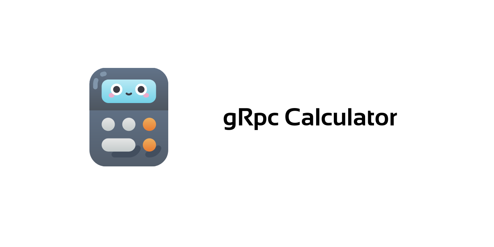

# gRPC calculator

This is a gRPC implementation of simple math tasks.


<!-- TABLE OF CONTENTS -->
<details open="open">
  <summary>Table of Contents</summary>
  <ol>
    <li>
      <a href="#about-the-project">About The Project</a>
      <ul>
        <li><a href="#built-with">Built With</a></li>
      </ul>
    </li>
    <li>
      <a href="#getting-started">Getting Started</a>
    </li>
    <li><a href="#further-possible-improvements">Further Possible Improvements</a></li>
  </ol>
</details>

## About The Project 

An example gRPC calculator usage could look like the following. By running the server in a first shell user will be notified, that it is serving and waiting for calls from client. By starting the client in the second shell window, user will be prompted to enter a simple equation, f.e `1 + 2 `. All allowed operations are `+`, `-`,`*` and `/`.

### Built With

* [Go](https://golang.org)
* [gRPC](https://grpc.io/docs/languages/go/quickstart/)


## Getting Started


1. Install dependencies
    ```shell script
    go mod download
    ```

1. In the first shell, start the server `gServer.go`
    ```shell script
    go run gServer.go
    ```

1. In the second shell, start the client `gClient.go`

    ```shell script
    go run gClient.go
    ```
1. Input some math operation
    ```
    1 + 1
    ```

    ```
    1000 / 13
    ```

    ```
    1000 * 13
    ```

### Further Possible Improvements

- parsing complex strings
- implementing additional math equations
- error handling 
